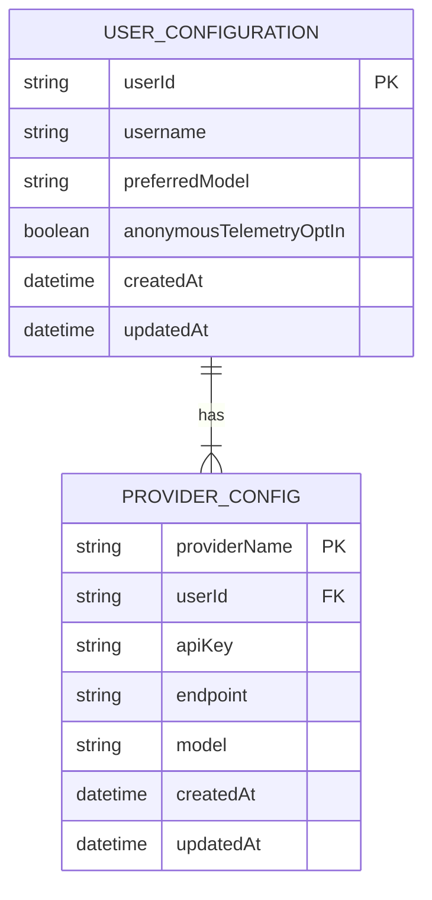
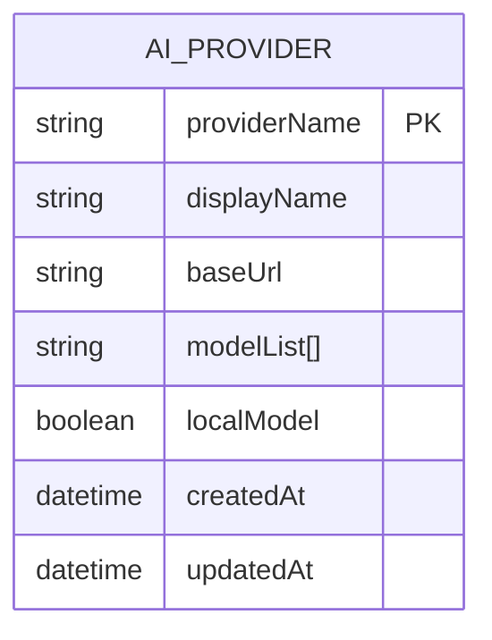
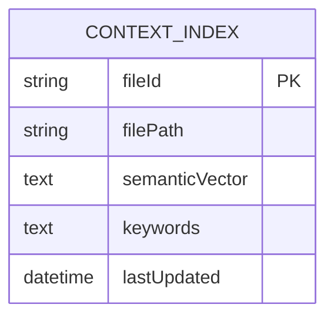
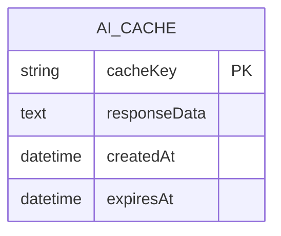

# Database Schemas

## Overview
The system relies on various data stores for user configurations, AI provider registrations, indexing data, conversation history, usage analytics, and caching. Below are the schema outlines.

## 1. User Configuration

- **USER_CONFIGURATION** stores per-user settings. In a single-user desktop environment, may store just one row.
- **PROVIDER_CONFIG** lists each provider’s credentials/key info for that user.

### Fields
- **userId**: Unique identifier for the user.
- **preferredModel**: The default AI model.
- **anonymousTelemetryOptIn**: Whether the user agrees to share usage data.

## 2. AI Provider Registry

- **AI_PROVIDER** contains metadata about each known provider.
- **modelList** may store a JSON array of available models.

## 3. Context Index

- **semanticVector**: Vector representation of file content for semantic searches.
- **keywords**: Extracted tokens or phrases.

### Index Considerations
- **Incremental Updates**: Keep entries aligned with changes in the codebase.
- **Scalability**: For large projects, consider a dedicated search engine or vector DB.

## 4. Conversation History
```mermaid
erDiagram
    CONVERSATION ||--|{ MESSAGE : has

    CONVERSATION {
        string conversationId PK
        string userId FK
        string mode
        datetime createdAt
        datetime updatedAt
    }

    MESSAGE {
        string messageId PK
        string conversationId FK
        string sender  // 'user' or 'ai'
        text content
        text contextSnapshot // optional partial code or reference
        datetime timestamp
    }
```
- **CONVERSATION**: Tracks multi-turn chats.
- **MESSAGE**: Each turn in the conversation.

### Data Lifecycle
- **Retention**: Users can clear or set retention schedule.
- **Privacy**: Potential encryption or local-only storage.

## 5. Usage Analytics
```mermaid
erDiagram
    USAGE_ANALYTICS {
        string eventId PK
        string userId FK
        string eventType // e.g., 'completionAccepted', 'refactorRequest'
        text payload
        datetime eventTime
    }
```
- **Anonymous** if user opts in.
- **payload** might store metadata, e.g., model used, latency.

## 6. Caching Layer

- **cacheKey**: Hash of request payload.
- **responseData**: AI response stored for fast retrieval.
- **expiresAt**: Time-based invalidation.

## Indexes and Optimization Considerations
1. **Unique Indexes**:
   - `userId` and `providerName` combos.
   - `cacheKey`.
2. **Search Indexing**:
   - For `semanticVector`, specialized indexing (e.g., embedding-based searches in a local vector DB or specialized service).
3. **Foreign Key Constraints**:
   - `userId` references user configuration.
   - `conversationId` references the conversation table.
4. **Data Lifecycle**:
   - Archive or purge old conversation messages.
   - Clear stale cache entries.

## Data Retention Policies
- **User Data**: Stored locally by default (single-user environment). Potentially sync via user account if configured.
- **Conversation Data**: Configurable retention; user can set how long to keep.
- **Analytics**: If user consents, minimal info kept for usage patterns. Purge upon request.

## Security & Compliance
- **Encryption**: Potential field-level encryption for API keys.
- **Access Control**: Typically single-user environment, but if multi-user, require user-level permissions.
- **Auditing**: Log sensitive operations (e.g., changing provider credentials).


---

This schema is a conceptual design. Implementation may vary depending on the chosen database engine (SQLite for local usage, or an embedded store). Extension to more advanced DB solutions is possible for large-scale multi-user or enterprise environments.
